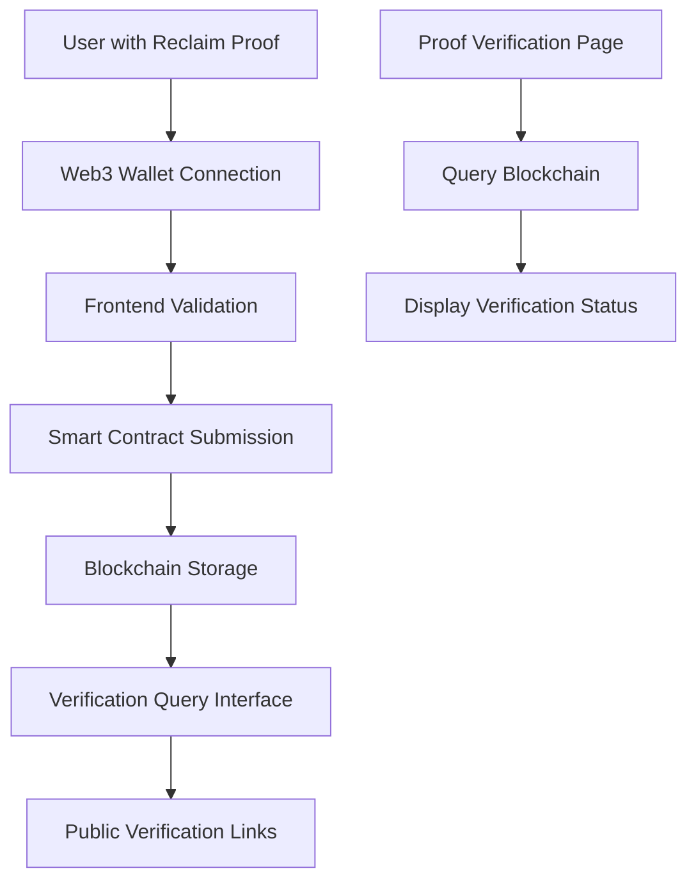

# Design Document

## Overview

The onchain proof verification feature will extend the existing ZK Identity Vault to support blockchain-based verification of Reclaim Protocol proofs. This system will consist of a Solidity smart contract for storing and verifying proofs, Web3 integration in the frontend, and new UI components for managing onchain verifications.

The design prioritizes gas efficiency, user experience, and security while maintaining the privacy-preserving nature of zero-knowledge proofs.

## Architecture

### High-Level Architecture



### Component Architecture

1. **Smart Contract Layer** (Solidity)
   - ProofRegistry contract for storing proof hashes and metadata
   - Verification logic for Reclaim Protocol proof structure
   - Event emission for indexing and monitoring

2. **Web3 Integration Layer** (TypeScript)
   - Wallet connection management (MetaMask, WalletConnect)
   - Contract interaction utilities
   - Transaction handling and error management

3. **Frontend Components** (React/Next.js)
   - Onchain verification UI components
   - Wallet connection interface
   - Proof management dashboard
   - Public verification pages

4. **Backend API Extensions** (Next.js API Routes)
   - Blockchain query endpoints
   - Proof indexing and caching
   - Public verification link generation

## Components and Interfaces

### Smart Contract Interface

```solidity
// ProofRegistry.sol
contract ProofRegistry {
    struct ProofRecord {
        bytes32 proofHash;
        address submitter;
        uint256 timestamp;
        string provider;
        bool isValid;
    }
    
    mapping(bytes32 => ProofRecord) public proofs;
    mapping(address => bytes32[]) public userProofs;
    
    event ProofSubmitted(
        bytes32 indexed proofHash,
        address indexed submitter,
        string provider,
        uint256 timestamp
    );
    
    function submitProof(
        bytes calldata proofData,
        string calldata provider
    ) external returns (bytes32);
    
    function verifyProof(bytes32 proofHash) external view returns (ProofRecord memory);
    
    function getUserProofs(address user) external view returns (bytes32[] memory);
}
```

### Web3 Integration Interface

```typescript
// lib/web3.ts
interface Web3Service {
  connectWallet(): Promise<string>;
  submitProofOnchain(proof: ProofData): Promise<string>;
  queryProofOnchain(proofHash: string): Promise<OnchainProofRecord>;
  getUserProofs(address: string): Promise<OnchainProofRecord[]>;
}

interface OnchainProofRecord {
  proofHash: string;
  submitter: string;
  timestamp: number;
  provider: string;
  isValid: boolean;
  transactionHash: string;
  blockNumber: number;
}
```

### Frontend Component Interface

```typescript
// components/OnchainVerification.tsx
interface OnchainVerificationProps {
  proof: ProofData;
  onSuccess: (txHash: string) => void;
  onError: (error: string) => void;
}

// components/ProofDashboard.tsx
interface ProofDashboardProps {
  userAddress: string;
  proofs: OnchainProofRecord[];
}
```

## Data Models

### Proof Hash Generation

The system will generate deterministic hashes of Reclaim proofs for blockchain storage:

```typescript
interface ProofHashInput {
  claimData: {
    provider: string;
    parameters: string;
    context: string;
  };
  signatures: string[];
  witnesses: any[];
}

// Hash = keccak256(abi.encodePacked(
//   provider,
//   parameters,
//   context,
//   signatures_hash,
//   witnesses_hash
// ))
```

### Onchain Storage Model

```solidity
struct ProofRecord {
    bytes32 proofHash;        // Deterministic hash of proof data
    address submitter;        // Address that submitted the proof
    uint256 timestamp;        // Block timestamp of submission
    string provider;          // Provider name (gmail, github, etc.)
    bool isValid;            // Validation result
}
```

### Frontend State Models

```typescript
interface OnchainVerificationState {
  status: 'idle' | 'connecting' | 'submitting' | 'success' | 'error';
  walletAddress: string | null;
  transactionHash: string | null;
  error: string | null;
}

interface ProofDashboardState {
  proofs: OnchainProofRecord[];
  loading: boolean;
  error: string | null;
}
```

## Error Handling

### Smart Contract Error Handling

```solidity
error InvalidProofStructure();
error ProofAlreadyExists();
error InvalidSignature();
error InsufficientWitnesses();
```

### Frontend Error Handling

1. **Wallet Connection Errors**
   - No wallet installed
   - User rejection
   - Network mismatch

2. **Transaction Errors**
   - Insufficient gas
   - Transaction reverted
   - Network congestion

3. **Proof Validation Errors**
   - Invalid proof structure
   - Missing required fields
   - Signature verification failure

### Error Recovery Strategies

- Automatic retry for network errors
- Clear error messages with suggested actions
- Fallback to alternative RPC endpoints
- Gas estimation with buffer for price fluctuations

## Testing Strategy

### Smart Contract Testing

1. **Unit Tests** (Foundry/Hardhat)
   - Proof submission validation
   - Hash generation consistency
   - Access control verification
   - Event emission testing

2. **Integration Tests**
   - End-to-end proof submission flow
   - Multi-user scenarios
   - Gas optimization validation

### Frontend Testing

1. **Component Tests** (Jest/React Testing Library)
   - Wallet connection flow
   - Proof submission UI
   - Error state handling
   - Loading state management

2. **E2E Tests** (Playwright)
   - Complete onchain verification flow
   - Cross-browser wallet integration
   - Mobile responsiveness

### Security Testing

1. **Smart Contract Auditing**
   - Reentrancy protection
   - Access control verification
   - Gas optimization review
   - Edge case handling

2. **Frontend Security**
   - Input validation
   - XSS prevention
   - Secure wallet integration

## Implementation Phases

### Phase 1: Smart Contract Development
- Deploy ProofRegistry contract
- Implement proof validation logic
- Add comprehensive testing
- Deploy to testnet

### Phase 2: Web3 Integration
- Add wallet connection functionality
- Implement contract interaction utilities
- Create transaction handling system
- Add error management

### Phase 3: Frontend Components
- Build onchain verification UI
- Create proof dashboard
- Add public verification pages
- Implement responsive design

### Phase 4: Backend Integration
- Add blockchain query APIs
- Implement proof indexing
- Create caching layer
- Add monitoring and analytics

## Blockchain Platform Selection

**Selected Platform: Sepolia Testnet (Ethereum)**

**Rationale:**
- Perfect for development and testing
- Free testnet ETH available from faucets
- Full Ethereum compatibility
- Easy deployment via Remix IDE
- Seamless transition to mainnet when ready

**Deployment Strategy:**
- Initial deployment on Sepolia testnet using Remix
- Comprehensive testing with testnet ETH
- Future migration to Base or Ethereum mainnet

## Gas Optimization Strategies

1. **Efficient Data Storage**
   - Store only proof hashes, not full proof data
   - Use packed structs to minimize storage slots
   - Implement batch operations for multiple proofs

2. **Smart Contract Optimization**
   - Use assembly for hash calculations
   - Optimize loop operations
   - Implement efficient data structures

3. **Frontend Optimization**
   - Batch multiple operations
   - Implement gas estimation
   - Provide gas price recommendations

## Security Considerations

1. **Smart Contract Security**
   - Implement access controls
   - Prevent reentrancy attacks
   - Validate all inputs
   - Use established patterns

2. **Proof Validation**
   - Verify Reclaim Protocol signatures
   - Validate witness attestations
   - Check proof structure integrity
   - Prevent replay attacks

3. **Frontend Security**
   - Secure wallet integration
   - Input sanitization
   - HTTPS enforcement
   - CSP headers implementation